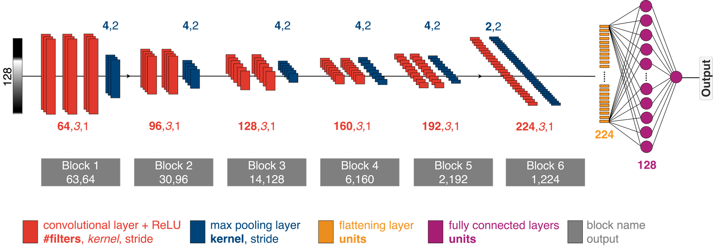

# AWI-ICENet1: Convolutional Neural Network for Ice Altimetry Retracking


**Authors:**  
- Veit Helm  
- Alireza Dehghanpour  
- *et al.*

> Developed at [Alfred Wegener Institute (AWI) as part of my PhD project](https://www.awi.de/).

---

  


---
## 📚 Overview

AWI-ICENet1 is a deep convolutional neural network (CNN) designed for retracking satellite radar altimeter waveforms over ice sheets. It minimizes radar signal penetration biases and improves surface elevation measurements, especially for CryoSat-2 Low Resolution Mode (LRM) data.

### Abstract
The Greenland and Antarctic ice sheets are important indicators of climate change and major contributors to sea level rise. Hence, precise, long-term observations of ice mass change are required to assess their contribution to sea level rise. These observations can be achieved directly by measuring regional changes in the Earth’s gravity field using the Gravity Recovery and Climate Experiment Follow-On (GRACE-FO) satellite system, indirectly by measuring changes in ice thickness using satellite altimetry, or by estimating changes in the mass budget using a combination of regional climate model data and ice discharge across the grounding line, based on multi-sensor satellite radar observations of ice velocity.

Satellite radar altimetry has been used to measure elevation change since 1992 through various missions. However, spatial and temporal variability in radar pulse penetration into the snowpack poses significant challenges, resulting in inaccuracies in surface elevation and consequently affecting surface elevation change (SEC) estimates. To improve the accuracy of surface elevation measurements and reduce SEC uncertainty, we developed a deep convolutional neural network (AWI-ICENet1). The model was trained on a simulated reference data set with 3.8 million waveforms, accounting for different surface slopes, topography, and attenuation.

The trained network was applied as a retracker to the full CryoSat-2 LRM waveform time series over both ice sheets. Comparisons with conventional retrackers, including the threshold first-maximum retracker algorithm (TFMRA) and ESA’s ICE1 and ICE2 products, demonstrate reduced uncertainty and significant mitigation of time-variable radar penetration effects. This eliminates the need for corrections based on backscatter and/or leading-edge width and provides new opportunities for utilizing convolutional neural networks in satellite altimetry data processing.

---

## 🚀 Key Features

- 📚 **Data Loader**: Efficient satellite waveform data handling.
- 🧠 **Deep CNN Model**: 6-block 1D ConvNet architecture for retracking.
- 🛠️ **Training Pipeline**: K-Fold cross-validation, metrics logging.
- 📊 **Metrics**: MSE, RMSE, MAE, R² — evaluated against reference retrackers.
- 🛰️ **Application**: Retracking CryoSat-2 LRM waveforms.
- 💾 **Output**: HDF5 model files and evaluation metrics CSVs.

---

## 💻 Installation

```bash
# Clone the repository
git clone https://github.com/Alireza202412/awi-icenet1-retracker.git
cd awi-icenet1-retracker

# Install dependencies
pip install -r requirements.txt
```

---

## ⚙️ Usage

```bash
# Train the model
python train.py --path /.../data
```

Make sure to prepare your `data/` directory with the following binary files:
- `ATT_ARR_XXX.bin`
- `SIM_WF_NO_NOISE_XXX.bin`
- `SIM_WF_NOISE_XXX.bin`
- `OCOG_ARR_XXX.bin`
- `REF_ARR_XXX.bin`
- `OCOG_ARR_NOISE_XXX.bin`

---

## 📁 Folder Structure

```
awi-icenet1-retracker/
├── data/                  
├── src/
│   ├── data_loader.py      
│   ├── model.py            
│   ├── train.py            
│   ├── utils.py            
├── README.md
└── requirements.txt
```

---

## 📚 Citation

If you use this retracker, please cite:

```
The Cryosphere, 18, 3933–3970. https://doi.org/10.5194/tc-18-3933-2024
```

---

## 🌐 Data

You can download the full simulated reference dataset, elevation change grids, and monthly elevation anomalies from the World Data Center PANGAEA:

[https://doi.org/10.1594/PANGAEA.964596](https://doi.org/10.1594/PANGAEA.964596)

---

## 👨‍💻 Developer Notes

🧩 **Code developed by Alireza Dehghanpour, 2023.**  
Additionally, a new repository will be added featuring extended multi-input multi-output (MIMO) neural network training scripts for enhanced waveform parameter estimation.

📧 Contact: [a.r.dehghanpour@gmail.com](mailto:a.r.dehghanpour@gmail.com)

---